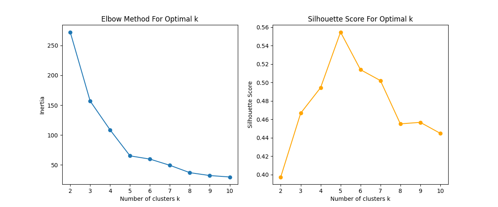
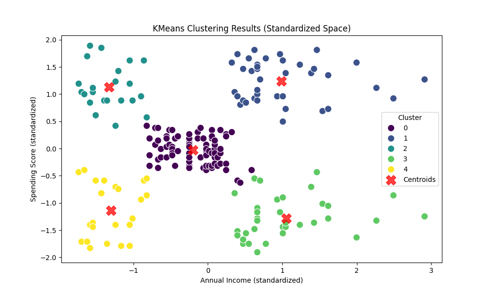

# Descrizione Dataset

## Analisi dei Dati

## Risultati del Clustering

L'analisi K-means ha identificato **4 cluster distinti** di clienti basati su reddito annuale e spending score, permettendo una segmentazione del dataset

### Cluster 0 - Clienti Medi (Centro)

- **Caratteristiche**: Reddito e spending score medi
- **Profilo**: Clienti con comportamento di spesa equilibrato e reddito nella media

#### Cluster 1 - Clienti Premium (Alto a Destra)

- **Caratteristiche**: Alto reddito + Alto spending score
- **Profilo**: Clienti con elevate disponibilità economiche e propensione alla spesa

#### Cluster 2 - Clienti Impulsivi (Alto a Sinistra)  

- **Caratteristiche**: Basso reddito + Alto spending score
- **Profilo**: Clienti che spendono molto nonostante reddito limitato
-

#### Cluster 3 - Clienti Parsimoniosi (Basso a Destra)

- **Caratteristiche**: Alto reddito + Basso spending score
- **Profilo**: Clienti benestanti ma attenti al risparmio

#### Cluster 4 - Clienti Economici (Basso a Sinistra)

- **Caratteristiche**: Basso reddito + Basso spending score
- **Profilo**: Clienti con budget limitato e spese contenute
